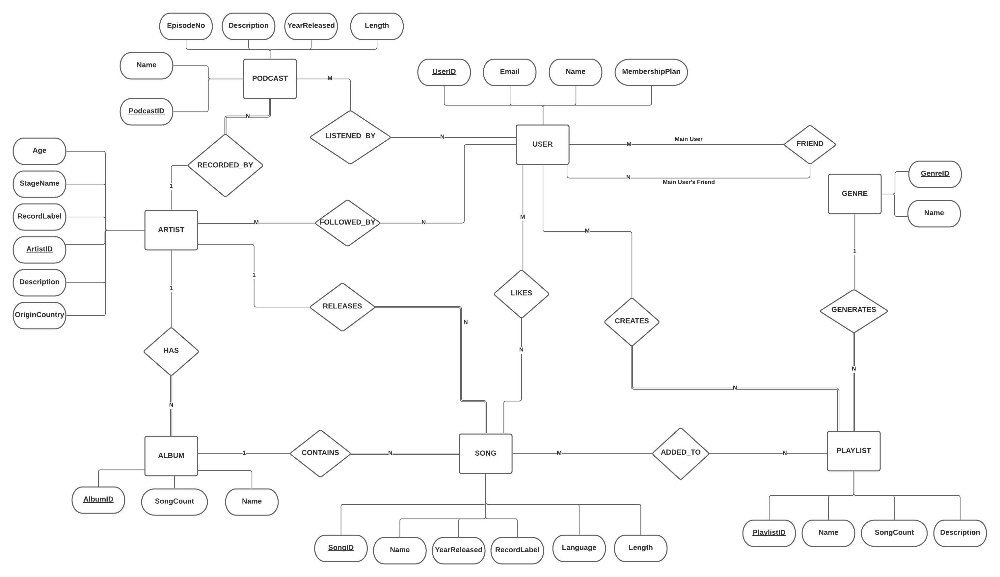
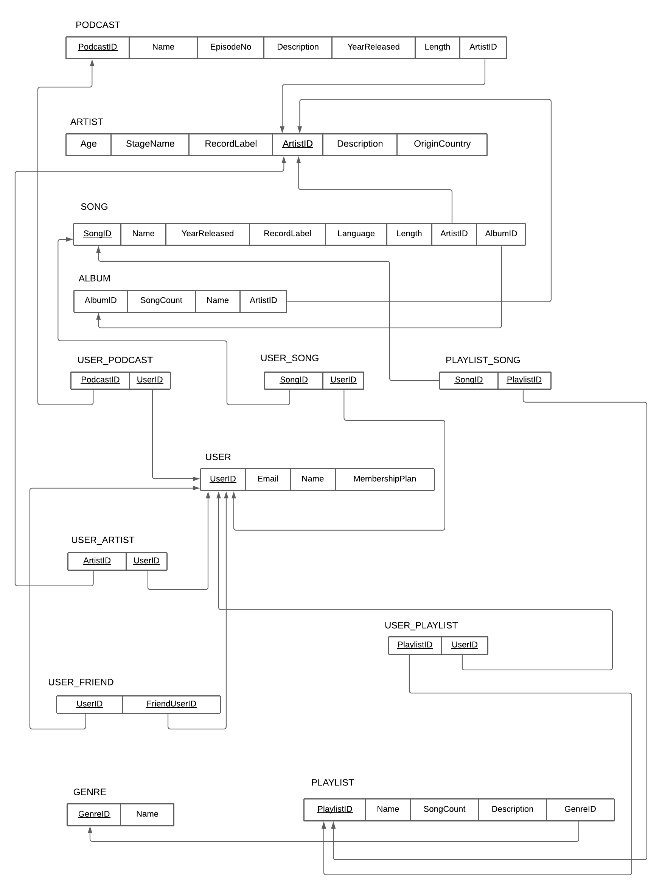

# DBMS Mini project Report  
# Music Library System

### Aadithya Krishna Vamshi V<br>PES2UG20CS003<br>Section A
 

---

## Short Description about the project and scope 

The music library system is to categorize and catelog every     single piece of music for music information and reviews.

The music library system uses Streamlit for frontend and MYSQL for the database.

## ER Diagram 


## Relational Schema 


## DDL statements to build the database 
```sql
CREATE TABLE `album` (
  `AlbumID` int(11) NOT NULL CHECK (`AlbumID` >= 10000 and `AlbumID` <= 99999),
  `SongCount` int(11) NOT NULL CHECK (`SongCount` > 0),
  `name` varchar(255) DEFAULT NULL,
  `ArtistID` int(11) NOT NULL CHECK (`ArtistID` >= 1000 and `ArtistID` <= 9999)
) ENGINE=InnoDB DEFAULT CHARSET=utf8mb4;

CREATE TABLE `artist` (
  `Age` int(11) NOT NULL,
  `StageName` varchar(255) NOT NULL,
  `RecordLabel` varchar(255) DEFAULT NULL,
  `ArtistID` int(11) NOT NULL CHECK (`ArtistID` >= 1000 and `ArtistID` <= 9999),
  `Description` text DEFAULT NULL,
  `OriginCountry` varchar(255) NOT NULL
) ENGINE=InnoDB DEFAULT CHARSET=utf8mb4;

CREATE TABLE `genre` (
  `GenreID` int(11) NOT NULL CHECK (`GenreID` > 0 and `GenreID` < 1000),
  `Name` varchar(255) NOT NULL
) ENGINE=InnoDB DEFAULT CHARSET=utf8mb4;

CREATE TABLE `playlist` (
  `PlaylistID` int(11) NOT NULL CHECK (`PlaylistID` >= 10000 and `PlaylistID` <= 99999),
  `Name` varchar(255) NOT NULL,
  `SongCount` int(11) NOT NULL CHECK (`SongCount` > 0),
  `Description` text DEFAULT NULL,
  `GenreID` int(11) NOT NULL CHECK (`GenreID` > 0 and `GenreID` < 1000)
) ENGINE=InnoDB DEFAULT CHARSET=utf8mb4;

CREATE TABLE `playlist_song` (
  `SongID` int(11) NOT NULL CHECK (`SongID` >= 100000 and `SongID` <= 999999),
  `PlaylistID` int(11) NOT NULL CHECK (`PlaylistID` >= 10000 and `PlaylistID` <= 99999)
) ENGINE=InnoDB DEFAULT CHARSET=utf8mb4;

CREATE TABLE `podcast` (
  `PodcastID` int(11) NOT NULL CHECK (`PodcastID` >= 1000 and `PodcastID` <= 9999),
  `Name` varchar(255) NOT NULL,
  `EpisodeNo` int(11) NOT NULL CHECK (`EpisodeNo` > 0),
  `Description` text DEFAULT NULL,
  `YearReleased` int(11) NOT NULL CHECK (`YearReleased` > 1600 and `YearReleased` <= 2021),
  `Length` time NOT NULL,
  `ArtistID` int(11) NOT NULL CHECK (`ArtistID` >= 1000 and `ArtistID` <= 9999)
) ENGINE=InnoDB DEFAULT CHARSET=utf8mb4;

CREATE TABLE `song` (
  `SongID` int(11) NOT NULL CHECK (`SongID` >= 100000 and `SongID` <= 999999),
  `Name` varchar(255) NOT NULL,
  `YearReleased` int(11) NOT NULL CHECK (`YearReleased` >= 1600 and `YearReleased` <= 2021),
  `RecordLabel` varchar(255) DEFAULT NULL,
  `Language` varchar(255) NOT NULL,
  `Length` time NOT NULL,
  `ArtistID` int(11) NOT NULL CHECK (`ArtistID` >= 1000 and `ArtistID` <= 9999),
  `AlbumID` int(11) NOT NULL CHECK (`AlbumID` >= 10000 and `AlbumID` <= 99999)
) ENGINE=InnoDB DEFAULT CHARSET=utf8mb4;

CREATE TABLE `users` (
  `UserID` int(11) NOT NULL CHECK (`UserID` > 10000 and `UserID` <= 99999),
  `Email` varchar(255) NOT NULL CHECK (`Email` like '%@%'),
  `Name` varchar(255) NOT NULL,
  `MembershipPlan` varchar(255) NOT NULL CHECK (`MembershipPlan` in ('Standard','Premium'))
) ENGINE=InnoDB DEFAULT CHARSET=utf8mb4;

CREATE TABLE `user_artist` (
  `ArtistID` int(11) NOT NULL CHECK (`ArtistID` >= 1000 and `ArtistID` <= 9999),
  `UserID` int(11) NOT NULL CHECK (`UserID` > 10000 and `UserID` <= 99999)
) ENGINE=InnoDB DEFAULT CHARSET=utf8mb4;

CREATE TABLE `user_friend` (
  `UserID` int(11) NOT NULL CHECK (`UserID` > 10000 and `UserID` <= 99999),
  `FriendUserID` int(11) NOT NULL CHECK (`FriendUserID` > 10000 and `FriendUserID` <= 99999)
) ENGINE=InnoDB DEFAULT CHARSET=utf8mb4;

CREATE TABLE `user_playlist` (
  `PlaylistID` int(11) NOT NULL CHECK (`PlaylistID` >= 10000 and `PlaylistID` <= 99999),
  `UserID` int(11) NOT NULL CHECK (`UserID` > 10000 and `UserID` <= 99999)
) ENGINE=InnoDB DEFAULT CHARSET=utf8mb4;

CREATE TABLE `user_podcast` (
  `PodcastID` int(11) NOT NULL CHECK (`PodcastID` >= 1000 and `PodcastID` <= 9999),
  `UserID` int(11) NOT NULL CHECK (`UserID` > 10000 and `UserID` <= 99999)
) ENGINE=InnoDB DEFAULT CHARSET=utf8mb4;

CREATE TABLE `user_song` (
  `SongID` int(11) NOT NULL CHECK (`SongID` >= 100000 and `SongID` <= 999999),
  `UserID` int(11) NOT NULL CHECK (`UserID` > 10000 and `UserID` <= 99999)
) ENGINE=InnoDB DEFAULT CHARSET=utf8mb4;

ALTER TABLE `album`  ADD PRIMARY KEY (`AlbumID`),  ADD KEY `ArtistID` (`ArtistID`);
ALTER TABLE `artist` ADD PRIMARY KEY (`ArtistID`);
ALTER TABLE `genre` ADD PRIMARY KEY (`GenreID`), ADD UNIQUE KEY `Name` (`Name`);
ALTER TABLE `playlist` ADD PRIMARY KEY (`PlaylistID`), ADD KEY `GenreID` (`GenreID`);
ALTER TABLE `playlist_song` ADD PRIMARY KEY (`SongID`,`PlaylistID`), ADD KEY `PlaylistID` (`PlaylistID`)
ALTER TABLE `podcast` ADD PRIMARY KEY (`PodcastID`), ADD KEY `ArtistID` (`ArtistID`);
ALTER TABLE `song` ADD PRIMARY KEY (`SongID`),  ADD KEY `ArtistID` (`ArtistID`), ADD KEY `AlbumID` (`AlbumID`);
ALTER TABLE `users` ADD PRIMARY KEY (`UserID`);
ALTER TABLE `user_artist` ADD PRIMARY KEY (`ArtistID`,`UserID`), ADD KEY `UserID` (`UserID`);
ALTER TABLE `user_friend` ADD PRIMARY KEY (`UserID`,`FriendUserID`), ADD KEY `FriendUserID` (`FriendUserID`);
ALTER TABLE `user_playlist` ADD PRIMARY KEY (`PlaylistID`,`UserID`), ADD KEY `UserID` (`UserID`);
ALTER TABLE `user_podcast` ADD PRIMARY KEY (`PodcastID`,`UserID`), ADD KEY `UserID` (`UserID`);
ALTER TABLE `user_song` ADD PRIMARY KEY (`SongID`,`UserID`), ADD KEY `UserID` (`UserID`);
ALTER TABLE `album` ADD CONSTRAINT `album_ibfk_1` FOREIGN KEY (`ArtistID`) REFERENCES `artist` (`ArtistID`);
ALTER TABLE `playlist` ADD CONSTRAINT `playlist_ibfk_1` FOREIGN KEY (`GenreID`) REFERENCES `genre` (`GenreID`);
ALTER TABLE `playlist_song` ADD CONSTRAINT `playlist_song_ibfk_1` FOREIGN KEY (`SongID`) REFERENCES `song` (`SongID`), ADD CONSTRAINT `playlist_song_ibfk_2` FOREIGN KEY (`PlaylistID`) REFERENCES `playlist` (`PlaylistID`);
ALTER TABLE `podcast` ADD CONSTRAINT `podcast_ibfk_1` FOREIGN KEY (`ArtistID`) REFERENCES `artist` (`ArtistID`);
ALTER TABLE `song` ADD CONSTRAINT `song_ibfk_1` FOREIGN KEY (`ArtistID`) REFERENCES `artist` (`ArtistID`), ADD CONSTRAINT `song_ibfk_2` FOREIGN KEY (`AlbumID`) REFERENCES `album` (`AlbumID`);
ALTER TABLE `user_artist` ADD CONSTRAINT `user_artist_ibfk_1` FOREIGN KEY (`ArtistID`) REFERENCES `artist` (`ArtistID`), ADD CONSTRAINT `user_artist_ibfk_2` FOREIGN KEY (`UserID`) REFERENCES `users` (`UserID`);
ALTER TABLE `user_friend` ADD CONSTRAINT `user_friend_ibfk_1` FOREIGN KEY (`UserID`) REFERENCES `users` (`UserID`), ADD CONSTRAINT `user_friend_ibfk_2` FOREIGN KEY (`FriendUserID`) REFERENCES `users` (`UserID`);
ALTER TABLE `user_playlist` ADD CONSTRAINT `user_playlist_ibfk_1` FOREIGN KEY (`PlaylistID`) REFERENCES `playlist` (`PlaylistID`), ADD CONSTRAINT `user_playlist_ibfk_2` FOREIGN KEY (`UserID`) REFERENCES `users` (`UserID`);
ALTER TABLE `user_podcast` ADD CONSTRAINT `user_podcast_ibfk_1` FOREIGN KEY (`PodcastID`) REFERENCES `podcast` (`PodcastID`), ADD CONSTRAINT `user_podcast_ibfk_2` FOREIGN KEY (`UserID`) REFERENCES `users` (`UserID`);
ALTER TABLE `user_song` ADD CONSTRAINT `user_song_ibfk_1` FOREIGN KEY (`SongID`) REFERENCES `song` (`SongID`), ADD CONSTRAINT `user_song_ibfk_2` FOREIGN KEY (`UserID`) REFERENCES `users` (`UserID`);

```

### Different methods used to populate data. - Show statements used under different methods 
```sql

INSERT INTO `album` (`AlbumID`, `SongCount`, `name`, `ArtistID`) VALUES
(10000, 3, 'Scary Hours 2', 6666),
(20000, 5, 'Watch the Throne', 4444),
(30000, 4, 'Aashiqui 2', 5555),
(40000, 1, 'Poco', 7777),
(50000, 2, 'Imma Brown Boy', 8888);

INSERT INTO `artist` (`Age`, `StageName`, `RecordLabel`, `ArtistID`, `Description`, `OriginCountry`) VALUES
(50, 'Jay-Z', 'Tidal', 4444, 'Jay-Z is Beyonces husband', 'U.S.A'),
(43, 'Arijit Singh', 'Bollywood', 5555, 'Arijit Singh is the second best singer from India', 'India'),
(34, 'Drake', 'OVO', 6666, 'Drake is a rapper from Toronto', 'Canada'),
(22, 'Christian Nodal', 'Lavida Loca', 7777, 'Christian is a popular corrido singer from Sinaloa', 'Mexico'),
(20, 'Ani', 'Nike Records', 8888, 'Ani used to work part-time at Mcdonalds', 'Indonesia');

INSERT INTO `genre` (`GenreID`, `Name`) VALUES
(400, 'Classical'),
(300, 'Country'),
(200, 'Hip Hop'),
(500, 'Jazz'),
(100, 'Rap');

INSERT INTO `playlist` (`PlaylistID`, `Name`, `SongCount`, `Description`, `GenreID`) VALUES
(10000, 'Study Jamz', 3, 'The best playlist for studying', 400),
(20000, 'Late Night Hustle', 4, 'The best beats and rhymes', 100),
(30000, 'Tractor In The Ditch', 3, 'For all the Southies out there', 300);

INSERT INTO `playlist_song` (`SongID`, `PlaylistID`) VALUES
(100001, 30000),
(100002, 30000),
(100003, 20000),
(111111, 30000),
(111112, 10000),
(111112, 20000),
(222222, 20000),
(222223, 10000),
(222224, 10000),
(222225, 20000),
(222226, 20000),
(222226, 30000),
(333333, 10000);

INSERT INTO `podcast` (`PodcastID`, `Name`, `EpisodeNo`, `Description`, `YearReleased`, `Length`, `ArtistID`) VALUES
(1000, 'Life in the 6ix', 1, 'Drake talks about his beef with Kanye', 2020, '01:10:48', 6666),
(2000, 'Makin Dolla$', 2, 'Jay-Z tells you how to hide your money from Bill', 2019, '00:56:48', 4444),
(2001, 'Makin Dolla$', 3, 'Jay-Z tells you how to get rich quick', 2020, '00:49:38', 4444);

INSERT INTO `song` (`SongID`, `Name`, `YearReleased`, `RecordLabel`, `Language`, `Length`, `ArtistID`, `AlbumID`) VALUES
(100001, 'Poco', 2020, 'LavidaLoca', 'Spanish', '00:03:45', 7777, 40000),
(100002, 'My mom hates me', 2020, 'Nike Records', 'English', '00:03:35', 8888, 50000),
(100003, 'I am the GOAT', 2020, 'Nike Records', 'Hindi', '00:05:45', 8888, 50000),
(111111, 'What\'s Next', 2021, 'OVO', 'English', '00:02:58', 6666, 10000),
(111112, 'Wants and Needs', 2021, 'OVO', 'English', '00:03:13', 6666, 10000),
(111113, 'Lemon Pepper Freestyle', 2021, 'OVO', 'English', '00:06:23', 6666, 10000),
(222222, 'Otis', 2011, 'Tidal', 'English', '00:02:58', 4444, 20000),
(222223, 'Gotta Have It', 2011, 'Tidal', 'English', '00:02:21', 4444, 20000),
(222224, 'New Day', 2011, 'Tidal', 'English', '00:06:23', 4444, 20000),
(222225, 'Liftoff', 2011, 'Tidal', 'English', '00:04:26', 4444, 20000),
(222226, 'Who Gon Stop Me', 2011, 'Tidal', 'English', '00:03:13', 4444, 20000),
(333333, 'Tum Hi Ho', 2013, 'Bollywood', 'Hindi', '00:02:25', 5555, 30000),
(333334, 'Sunn Raha Hai', 2013, 'Bollywood', 'Hindi', '00:03:15', 5555, 30000),
(333335, 'Bhula Dena', 2013, 'Bollywood', 'Hindi', '00:04:43', 5555, 30000),
(333336, 'Meri Aashiqui', 2013, 'Bollywood', 'Hindi', '00:02:55', 5555, 30000);

INSERT INTO `users` (`UserID`, `Email`, `Name`, `MembershipPlan`) VALUES
(10001, 'gsbrar@uw.edu', 'Jay', 'Standard'),
(20000, 'joacotaco@hotmail.mx', 'Joaquin', 'Premium'),
(30000, 'mcds@hotmail.com', 'Ani', 'Standard'),
(40000, 'seahawksguyxo@gmail.com', 'Srikar', 'Premium'),
(50000, 'madhav@uw.edu', 'Madhav', 'Premium');

INSERT INTO `user_artist` (`ArtistID`, `UserID`) VALUES
(4444, 40000),
(5555, 20000),
(6666, 10001),
(7777, 30000),
(8888, 50000);

INSERT INTO `user_friend` (`UserID`, `FriendUserID`) VALUES
(10001, 20000),
(10001, 30000),
(30000, 20000),
(30000, 40000),
(40000, 50000),
(50000, 20000);

INSERT INTO `user_playlist` (`PlaylistID`, `UserID`) VALUES
(10000, 10001),
(20000, 20000),
(30000, 30000);

INSERT INTO `user_podcast` (`PodcastID`, `UserID`) VALUES
(1000, 10001),
(1000, 30000),
(1000, 40000),
(2000, 20000),
(2000, 40000),
(2001, 20000),
(2001, 40000);

INSERT INTO `user_song` (`SongID`, `UserID`) VALUES
(100001, 10001),
(100002, 20000),
(100003, 30000),
(111111, 10001),
(111111, 30000),
(111112, 20000),
(222222, 10001),
(222223, 40000),
(222225, 50000),
(333333, 40000),
(333335, 50000),
(333336, 40000);
```
### JOIN queries 
```sql
select  * from artist join album
```
### Aggregate Functions 
```sql
-- total no of songs in that album 
select sum(SongCount) from album;

-- total no of friends
select count(FriendUserID) from user_friend where UserID = 10001; 

-- min number of tracks in an album
select name, min(SongCount) from album

-- max number of tracks in an album
select name, max(SongCount) from album 
```

### SET Operators 
```sql
SELECT SongID FROM song   INTERSECT  SELECT SongID FROM playlist_song; 
```
### Functions and Procedure 

> Function
```sql
DELIMITER $$
CREATE DEFINER=`root`@`localhost` FUNCTION `album_deets`(`SongCount` INT) RETURNS varchar(30) CHARSET utf8mb4
BEGIN
	DECLARE albtyp varchar(255);
    if SongCount=1 THEN
    	SET albtyp = "SINGLE";
    ELSEIF SongCount>2 AND SongCount<5 THEN
    	SET albtyp = "EXCLUSIVE";
    ELSE
    	SET albtyp = "DELUXE";
    END IF;
    RETURN albtyp;
END$$
DELIMITER ;
```

> Procedure
```sql
DELIMITER $$
CREATE DEFINER=`root`@`localhost` PROCEDURE `artist_album`(IN `art_id` INT(50), OUT `alb_name` VARCHAR(255), OUT `no_of_tracks` INT(10))
BEGIN
SELECT name, SongCount
INTO alb_name, no_of_tracks
FROM album
WHERE ArtistID=art_id;
END$$
DELIMITER ;
```


### Triggers 
```sql
CREATE TRIGGER `friend_exists` BEFORE UPDATE ON `user_friend`
 FOR EACH ROW BEGIN
DECLARE err_msg varchar(255);
SET err_msg =  "Friend already exists";
IF NEW.FriendUserID = OLD.FriendUserID THEN
	SIGNAL SQLSTATE '45000'
    SET MESSAGE_TEXT = err_msg;
    END IF;
IF NEW.FriendUserID <> OLD.FriendUserID THEN
    SET NEW.FriendUserID = NEW.FriendUserID;
    END IF;
END
```


###  Higher Level Programming - A simple frontend that talks to the backend database is required to be developed .  

